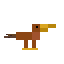

#  Bill

A modern build system for Java with Cargo-inspired simplicity.

## Overview

Bill aims to bring the simplicity and elegance of Rust's Cargo to the Java ecosystem. Configure your project with a clean `bill.toml` file, and Bill handles dependency resolution, compilation, testing, and packaging with sensible defaults and minimal configuration.

## Goals

- **Simple configuration**: Clean TOML-based project files instead of verbose XML
- **Fast and reliable**: Efficient dependency resolution with fail-fast conflict detection
- **Maven compatible**: Full interoperability with Maven Central and existing Maven repositories
- **Modern Java**: Built with JDK 25+ to leverage the latest language features
- **Reproducible builds**: Deterministic JAR creation for consistent artifacts

## Project Status

🚧 **Early Development** - Phase 1 (Foundation) in progress

Bill is currently in active development. The project structure is being established with Maven as the bootstrap build tool. This is a ground-up implementation focused on getting dependency resolution right before adding features.

### Current Milestone: Foundation (Phase 1)

- ✅ Maven parent POM with JDK 25 configuration
- ✅ Core module structure
- ⏳ Module skeletons for TOML parser and Maven client

### Upcoming Phases

1. **Foundation** ← Current phase
2. TOML Parser - Parse bill.toml configuration files
3. Maven Client - Download artifacts from Maven Central
4. Dependency Resolution - Core resolution algorithm with conflict detection
5. Dependency Scopes - Handle compile-only, runtime-only, test-only scopes
6. Compilation - Java source compilation
7. Test Execution - TestNG integration
8. JAR Packaging - Reproducible JAR creation
9. CLI Interface - `bill build`, `bill test`, `bill run` commands
10. Integration - End-to-end testing and polish

## Building

Bill currently uses Maven as its bootstrap build tool:

```bash
mvn clean verify
```

## License

Bill is available under a custom license:
- **Personal use:** Free and open source
- **Commercial use:** Requires a paid license

See [LICENSE](LICENSE) for full terms.

For commercial licensing inquiries, contact: cowwoc2020@gmail.com

## Contributing

Bill is in early development. Contributions will be welcome once the core architecture is established.
